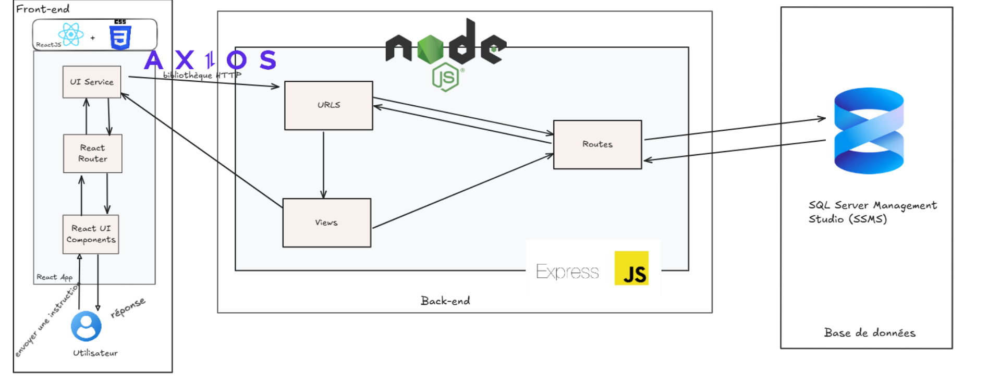
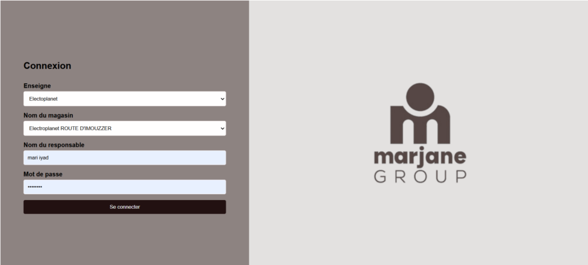

# Plateforme SAV

Une **plateforme web de gestion du Service Après-Vente (SAV)** développée lors de mon stage au sein de **Marjane Group**, durant ma première année du cycle ingénieur à l’**ENSIAS**.

La plateforme permet de centraliser la gestion des réclamations clients, des magasins et des techniciens pour les enseignes **Marjane** et **Electroplanet**.

---

## 📌 Présentation du projet

Le projet consiste à digitaliser le processus de **Service Après-Vente** à travers une plateforme centralisée permettant de gérer les réclamations et de faciliter leur suivi.

La plateforme met en relation les différents acteurs du processus SAV : **responsables de magasin, administrateurs et techniciens**.

---

## 🎯 Objectifs

Les principaux objectifs du projet sont :

* Centraliser les réclamations clients.
* Faciliter la création et le suivi des réclamations.
* Centraliser la gestion des magasins et des techniciens.
* Faciliter l’affectation des techniciens selon leur spécialité.
* Assurer le suivi de l’état des réclamations.
* Automatiser la notification des techniciens par e-mail.
* Mettre en place une gestion des accès selon les rôles.
* Améliorer la traçabilité du processus SAV.

---

## 👥 Diagramme de cas d’utilisation


Le diagramme présente les principales interactions entre les différents acteurs et la plateforme de gestion du Service Après-Vente.

---

## 👥 Rôles des utilisateurs

### 👨‍💼 Responsable de magasin

Le responsable de magasin peut :

* S’authentifier sur la plateforme.
* Créer une réclamation.
* Consulter l’historique des réclamations.
* Rechercher une réclamation par numéro de contrat.
* Consulter les détails d’une réclamation.
* Modifier les informations d’une réclamation.
* Suivre l’état des réclamations.

### 👨‍💻 Administrateur

L’administrateur dispose d’une vue globale de la plateforme et peut :

* Consulter les réclamations des différents magasins.
* Filtrer les réclamations par enseigne.
* Gérer les magasins.
* Ajouter, modifier et supprimer des magasins.
* Gérer les techniciens.
* Ajouter, modifier et supprimer des techniciens.

### 🔧 Technicien

Le technicien :

* Reçoit les réclamations qui lui sont affectées.
* Reçoit une notification par e-mail.
* Consulte les informations nécessaires à l’intervention.

---

## ⚙️ Fonctionnalités principales

### 🔐 Authentification

La plateforme propose un système d’authentification adapté aux différents rôles.

**Responsable de magasin :**

* Enseigne
* Magasin
* Nom du responsable
* Mot de passe

**Administrateur :**

* Nom d’utilisateur
* Mot de passe

### 📝 Gestion des réclamations

Le responsable de magasin peut créer une réclamation en renseignant :

* Nom du client
* Numéro de téléphone
* Numéro de contrat
* Produit concerné
* Motif de la réclamation
* Spécialité du produit
* Statut

L’enseigne et le magasin sont automatiquement associés à partir du compte du responsable connecté.

Le statut initial d’une nouvelle réclamation est **Ouverte**.

### 🔎 Suivi des réclamations

Les réclamations peuvent être consultées à partir de leur :

* Date
* Client
* Produit
* Technicien affecté
* Durée de vie du produit
* Statut

Une recherche par **numéro de contrat** est également disponible.

### 👨‍🔧 Gestion des techniciens

L’administrateur peut gérer les informations des techniciens :

* Nom
* Adresse e-mail
* Spécialité
* Enseigne

### 🏪 Gestion des magasins

L’administrateur peut :

* Ajouter un magasin.
* Modifier un magasin.
* Supprimer un magasin.

Chaque magasin est associé à une enseigne et à un responsable.

### 📧 Notification par e-mail

Lorsqu’une réclamation est affectée à un technicien, la plateforme lui envoie automatiquement un e-mail contenant les informations relatives à la réclamation.

---

## 🔄 Processus de traitement d’une réclamation

Le traitement d’une réclamation suit le flux suivant :

```text
Responsable de magasin
        │
        ▼
   Authentification
        │
        ▼
Vérification des identifiants
        │
        ▼
Accès à l’application
        │
        ▼
Consultation de l’historique
        │
        ▼
Création d’une réclamation
        │
        ▼
Saisie des informations
        │
        ▼
Enregistrement de la réclamation
        │
        ▼
Affectation d’un technicien
        │
        ▼
Notification du technicien par e-mail
        │
        ▼
Intervention du technicien
        │
        ▼
Mise à jour du statut
        │
        ▼
Suivi de la réclamation
```

---

## 🏗️ Architecture du système

L’application repose sur une architecture web composée de trois principaux niveaux :

* **Frontend** : interface utilisateur développée avec React.js.
* **Backend** : serveur applicatif et API développés avec Node.js et Express.js.
* **Base de données** : stockage des données dans Microsoft SQL Server.



---

## 📋 Gestion du projet

Le projet a été géré selon la **méthodologie Kanban**.

Le flux de travail était organisé autour de quatre étapes :

```text
Backlog → Doing → Review → Done
```

Cette organisation a permis de suivre l’avancement des tâches tout au long du développement.

---

## 🖥️ Interfaces de l’application

Les principales interfaces de la plateforme sont présentées ci-dessous. **Les autres captures d’écran sont disponibles dans le dossier [`app_img`](./app_img).**

### 🔐 Interface de connexion

Permet aux utilisateurs d’accéder à la plateforme selon leur rôle.



### 📋 Historique des réclamations

Permet au responsable de magasin de consulter et rechercher ses réclamations.


### 📝 Création d’une réclamation

Formulaire permettant d’enregistrer une nouvelle réclamation client.


### 🏪 Administration

Interfaces permettant à l’administrateur de gérer les magasins et les techniciens.


### 📧 Notification par e-mail

E-mail envoyé au technicien lorsqu’une réclamation lui est affectée.


---

## 🛠️ Technologies utilisées

### Frontend

* **React.js**
* **JavaScript**
* **HTML5**
* **CSS3**

### Backend

* **Node.js**
* **Express.js**

### Base de données

* **Microsoft SQL Server**
* **SQL Server Management Studio (SSMS)**

### Outils

* **Visual Studio Code**
* **Git / GitHub**
* **Trello**

---

## 🚀 Installation

### 1. Cloner le dépôt

```bash
git clone <repository-url>
cd SAV
```

### 2. Installer les dépendances du backend

```bash
cd server
npm install
```

### 3. Installer les dépendances du frontend

```bash
cd ../react-client
npm install
```

### 4. Démarrer le backend

```bash
cd ../server
npm start
```

### 5. Démarrer le frontend

Dans un autre terminal :

```bash
cd react-client
npm start
```

---

## 🔒 Sécurité

La plateforme intègre un système d’authentification et de gestion des rôles permettant de contrôler l’accès aux différentes fonctionnalités selon le profil de l’utilisateur.

Les informations sensibles, telles que les identifiants de connexion à la base de données, ne doivent pas être publiées dans le dépôt GitHub.

---

## 📚 Contexte du projet

Ce projet a été réalisé dans le cadre de mon **stage au sein de Marjane Group**, durant ma **première année du cycle ingénieur à l’ENSIAS**.

Cette expérience m’a permis de mettre en pratique mes connaissances en développement web, conception d’API, gestion de bases de données, architecture logicielle et gestion de projet.

---

## 👩‍💻 Auteure

**BARARA Wafae**

Étudiante ingénieure — ENSIAS
